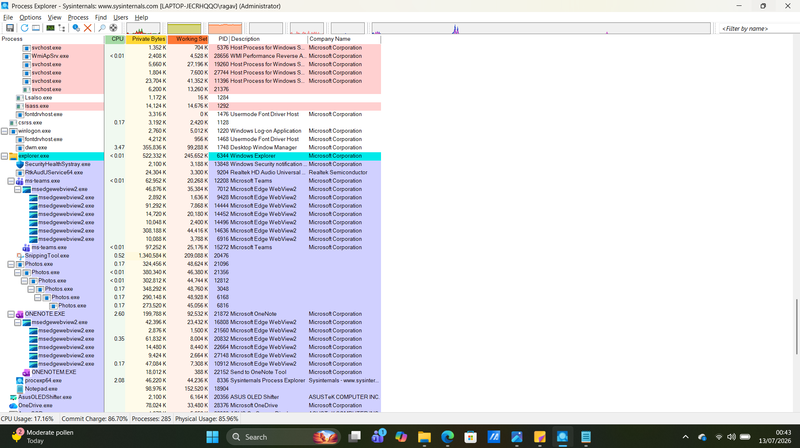
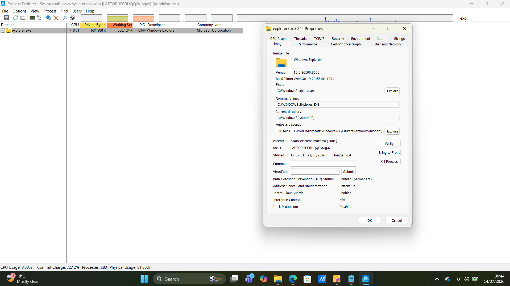
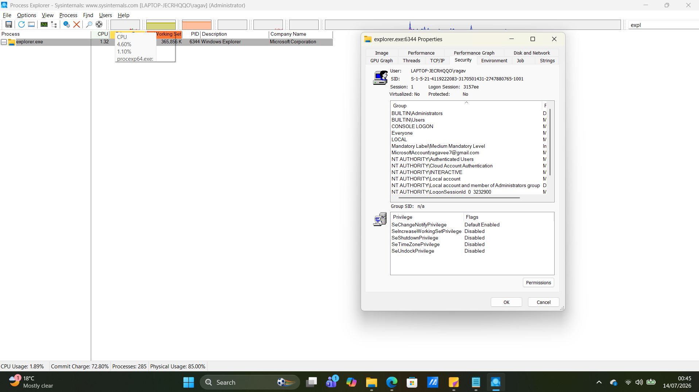

# Chapter 01 - Process Explorer

## What is Process Explorer?

Process Explorer is an advanced process monitoring tool from the Microsoft Sysinternals Suite. It provides much more information than Windows Task Manager and is commonly used by SOC analysts to investigate running processes, memory usage, parent-child relationships, executable paths, and process security.

---

# Why is it important?

Process Explorer helps analysts:

- Investigate suspicious processes
- Verify executable locations
- Check parent-child relationships
- Analyze CPU and memory usage
- Review process privileges
- Detect abnormal Windows activity

---

# How to Open Process Explorer

1. Download Process Explorer from Microsoft Sysinternals.
2. Extract the ZIP file.
3. Run **procexp64.exe** as Administrator.
4. Wait for the process list to load.

---

# Main Window

The main window displays all running Windows processes in a tree structure.

### Screenshot

---

# Process Properties

Double-clicking a process opens the Process Properties window.

Here you can inspect:

- Image
- Performance
- Security
- Threads
- TCP/IP
- Environment

### Screenshot

---

# Image Tab

The Image tab contains information about the executable.

Look for:

- Executable Path
- Parent Process
- Command Line
- Company Name
- Digital Signature

Questions to ask:

- Is the executable running from the correct folder?
- Is it signed by Microsoft?
- Does the command line look normal?

---

# Security Tab

The Security tab shows the security context of the process.

Review:

- User Account
- SID
- Group Membership
- Privileges

### Screenshot

Questions to ask:

- Which user started the process?
- Does it have administrator privileges?
- Does anything look unusual?

---

# Red Flags

Investigate if you see:

- Random executable names
- Processes running from Temp folders
- Unsigned executables
- High CPU usage
- High memory usage
- Suspicious parent-child relationships

---

# Key Takeaways

- Process Explorer provides more information than Task Manager.
- Always verify the executable path.
- Parent-child relationships are important during investigations.
- High CPU or memory usage is not always malicious.
- Process properties provide valuable forensic information.
