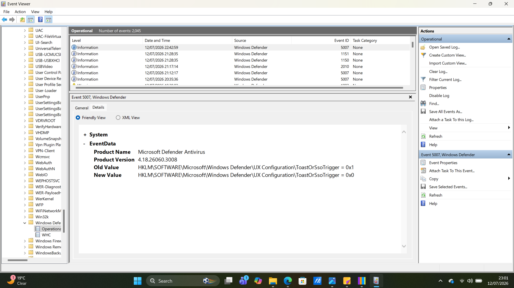

# Chapter 02 - Event Viewer

## What is Event Viewer?

Event Viewer is a built-in Windows tool that records system, application, security, and hardware events. It is one of the most important tools used by SOC analysts and incident responders to investigate Windows activity, identify errors, and review security-related events.

---

# Why is it Important?

Event Viewer helps analysts:

- Investigate Windows errors
- Review security events
- Analyze Windows Defender activity
- Identify failed logins
- Monitor application crashes
- Track system changes
- Support incident response investigations

---

# How to Open Event Viewer

Method 1

1. Press **Windows + R**
2. Type **eventvwr.msc**
3. Press Enter

Method 2

1. Open the Start Menu
2. Search **Event Viewer**
3. Open the application

---

# Event Viewer Layout

The Event Viewer interface consists of three main sections.

### Navigation Pane

Displays all Windows event logs.

Common logs include:

- Application
- Security
- Setup
- System
- Forwarded Events
- Windows Defender
- Windows PowerShell

### Event List

Displays individual events.

Each event includes:

- Level
- Date and Time
- Source
- Event ID
- Task Category

### Details Pane

Displays additional information about the selected event.

You can switch between:

- General View
- Details (Friendly View)
- XML View

---

# Event ID

Every Windows event has an Event ID.

The Event ID identifies the type of activity that occurred.

Examples:

- 4624 – Successful Logon
- 4625 – Failed Logon
- 4688 – Process Created
- 5007 – Windows Defender Configuration Changed

Event IDs help analysts quickly identify specific Windows activities.

---

# General Tab

The General tab provides a human-readable explanation of the event.

Review:

- What happened
- When it happened
- Why Windows generated the event
- Any warning messages

### Screenshot

---

# Details Tab

The Details tab provides structured information about the event.

Friendly View displays event fields in an easy-to-read format.

XML View displays the raw event data.

### Screenshot of Friendly view display

### Screenshot of XML view display

---

# What Should You Look For?

When reviewing events, ask yourself:

- Is this expected?
- Who generated the event?
- What changed?
- When did it occur?
- Does it match other activity?

---

# Red Flags

Investigate if you observe:

- Multiple failed login attempts
- Windows Defender being disabled
- Defender configuration changes
- Unexpected account creation
- Service installation events
- PowerShell execution events
- Unknown process creation events

---

# Key Takeaways

- Event Viewer records Windows activity.
- Event IDs identify specific events.
- The General tab explains what happened.
- The Details tab provides structured investigation data.
- XML View shows the raw event information.
- Event Viewer is one of the first tools used during Windows investigations.
