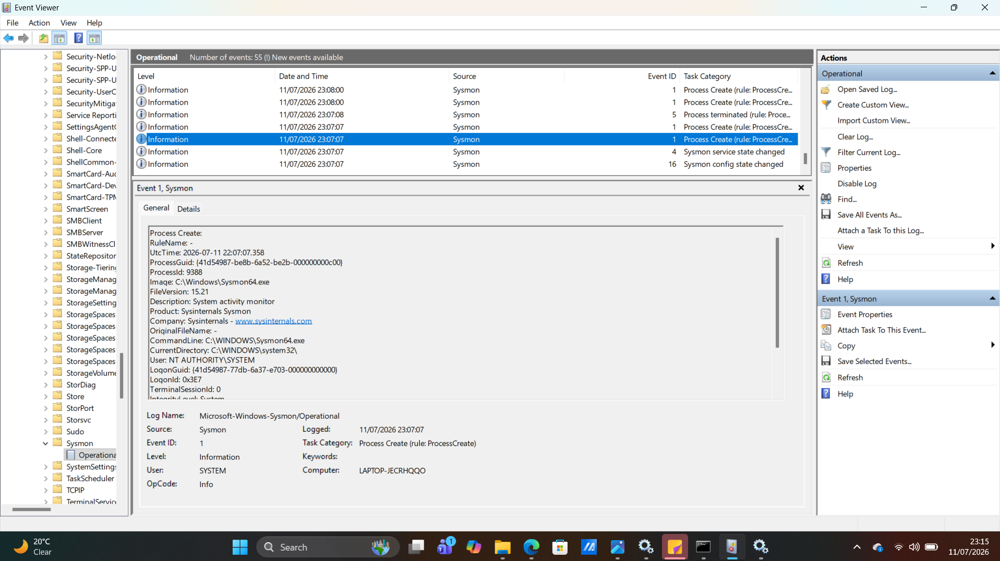

# Chapter 03 - Sysmon

## What is Sysmon?

Sysmon (System Monitor) is a Microsoft Sysinternals tool that extends Windows logging by recording detailed system activity. It runs in the background as a Windows service and stores its logs in Event Viewer, giving security analysts much greater visibility into endpoint activity.

---

# Why is it Important?

Sysmon helps analysts:

- Monitor process creation
- Track network connections
- Detect registry changes
- Monitor file creation
- Investigate malware activity
- Support threat hunting
- Improve incident response investigations

---

# How to Install Sysmon

1. Download Sysmon from the Microsoft Sysinternals website.
2. Extract the ZIP file.
3. Open Command Prompt as Administrator.
4. Run:

```cmd
sysmon64.exe -accepteula -i
```

5. Open Event Viewer.
6. Navigate to:

Applications and Services Logs

→ Microsoft

→ Windows

→ Sysmon

→ Operational

---

# Sysmon Operational Log

The Sysmon Operational log contains all events generated by Sysmon.

Each event records detailed information about activity occurring on the endpoint.

### Screenshot



---

# Common Sysmon Event IDs

| Event ID | Description |
|----------|-------------|
| 1 | Process Creation |
| 3 | Network Connection |
| 7 | Image Loaded |
| 11 | File Created |
| 13 | Registry Value Set |
| 22 | DNS Query |

These Event IDs help analysts quickly identify the type of activity that occurred.

---

# Event Details

Selecting an event displays detailed information such as:

- Process Name
- Process ID
- Command Line
- Current Directory
- User Account
- Process GUID
- Image Path

This information helps analysts understand how a process was executed.

---

# What Should You Look For?

During investigations, verify:

- Process Name
- Parent Process
- Command Line
- Executable Path
- User Account
- Event ID
- Time Created

Ask yourself:

- Is this process expected?
- Is it running from the correct location?
- Does the command line look suspicious?
- Who executed the process?

---

# Red Flags

Investigate if you observe:

- PowerShell with encoded commands
- Unknown executable names
- Processes running from Temp or AppData
- Suspicious command-line arguments
- Unexpected parent-child relationships
- Connections to unknown IP addresses

---

# Key Takeaways

- Sysmon provides enhanced Windows logging.
- Event Viewer stores Sysmon events in the Operational log.
- Event IDs identify different types of system activity.
- Event ID 1 records process creation events.
- Sysmon is one of the most valuable tools for SOC analysts, threat hunters, and incident responders.
