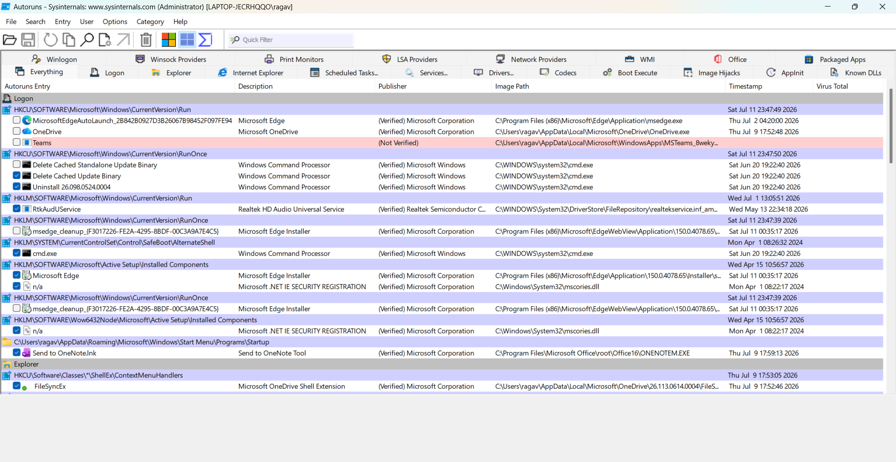
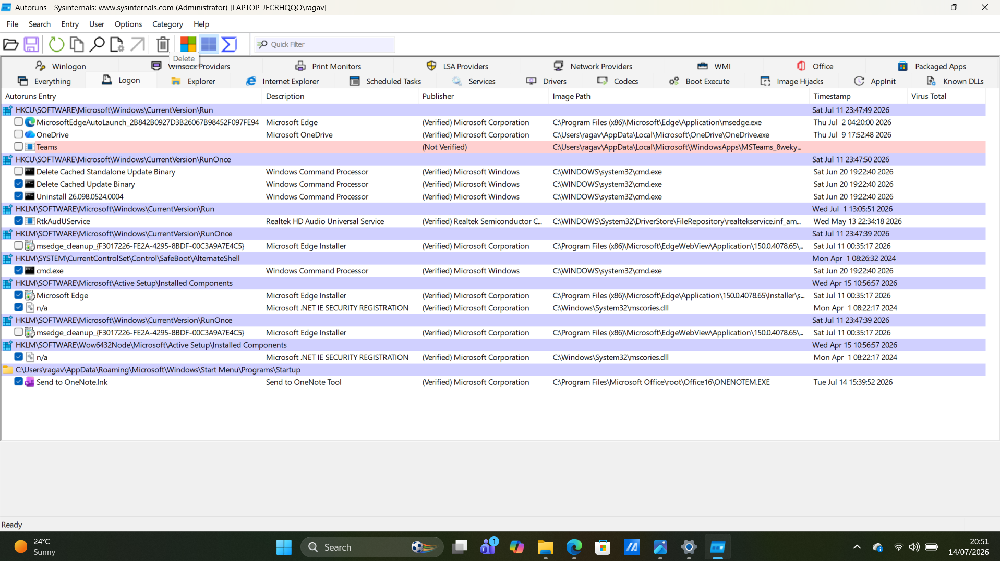

# Chapter 04 - Autoruns

## What is Autoruns?

Autoruns is a Microsoft Sysinternals tool that displays every program, service, driver, scheduled task, and registry entry configured to start automatically when Windows boots or when a user signs in. It is one of the most effective tools for identifying persistence mechanisms used by legitimate software and malware.

---

## Why is it Important?

Autoruns helps analysts:

- Identify startup programs
- Detect persistence mechanisms
- Review scheduled tasks
- Inspect Windows services and drivers
- Verify digital signatures
- Support malware investigations
- Detect suspicious auto-start entries

---

## How to Open Autoruns

1. Download Autoruns from the Microsoft Sysinternals website.
2. Extract the ZIP file.
3. Run **Autoruns64.exe** as Administrator.
4. Wait for Autoruns to scan the system.
5. Review the different tabs to inspect Windows auto-start locations.

---

## Everything Tab

The **Everything** tab displays all auto-start entries collected from Windows. It combines information from Logon, Services, Drivers, Scheduled Tasks, Explorer extensions, and many other startup locations into a single view.

Review:

- Autorun Entry
- Description
- Publisher
- Image Path
- Timestamp
- VirusTotal (if enabled)

### Screenshot

---

## Logon Tab

The **Logon** tab displays applications that automatically start when a user signs into Windows.

Typical entries include:

- Microsoft Edge
- OneDrive
- Microsoft Teams
- Audio services
- Startup folder shortcuts

Although the Logon tab may appear similar to the Everything tab on some systems, it only displays logon-related startup entries.

### Screenshot

---

## What Should You Look For?

During investigations, review:

- Startup application name
- Publisher
- Executable path
- Registry location
- Digital signature
- Startup folder entries

Ask yourself:

- Is this application expected?
- Is the publisher legitimate?
- Does the executable run from a trusted location?
- Is the entry digitally signed?

---

## Red Flags

Investigate if you observe:

- Unknown startup applications
- Unsigned executables
- Random or suspicious filenames
- Programs launching from AppData or Temp folders
- Unknown scheduled tasks
- Unexpected Windows services
- Unrecognized drivers

---

## Common Legitimate Entries

Examples of normal startup entries include:

- Microsoft Edge
- Microsoft OneDrive
- Microsoft Teams
- Realtek Audio Service
- Windows Security

Always verify the publisher before assuming an entry is malicious.

---

## Key Takeaways

- Autoruns displays all Windows auto-start locations.
- The Everything tab provides a complete overview of startup entries.
- The Logon tab focuses on applications that launch when a user signs in.
- Executable paths and digital signatures should always be verified.
- Autoruns is one of the most valuable tools for detecting persistence mechanisms during malware investigations.

