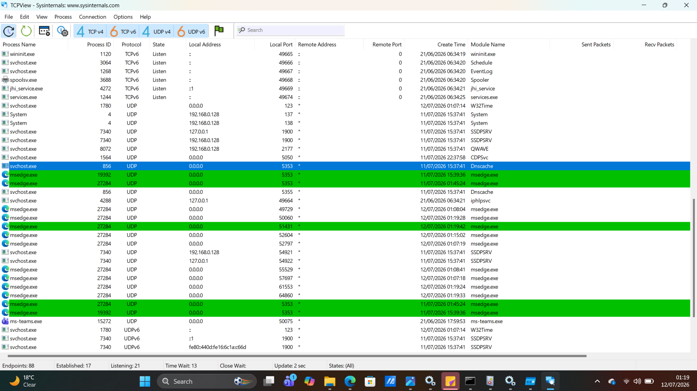

# Chapter 05 - TCPView

## What is TCPView?

TCPView is a Microsoft Sysinternals tool that displays all active TCP and UDP network connections on a Windows computer in real time. It allows security analysts to identify which processes are communicating over the network and where those connections are established.

---

## Why is it Important?

TCPView helps analysts:

- Monitor active network connections
- Identify listening ports
- Detect suspicious outbound connections
- Map processes to network activity
- Support malware investigations
- Troubleshoot network issues

---

## How to Open TCPView

1. Download TCPView from Microsoft Sysinternals.
2. Extract the ZIP file.
3. Run **Tcpview64.exe** as Administrator.
4. Wait for TCPView to populate active connections.

---

## Main Interface

The main interface displays every active TCP and UDP connection.

Important columns include:

- Process Name
- Protocol
- Local Address
- Local Port
- Remote Address
- Remote Port
- State

### Screenshot

---

## Connection States

TCPView displays different connection states.

Common states include:

- Listening
- Established
- Close Wait
- Time Wait
- Syn Sent
- Syn Received

The most common state during normal activity is **Established**, meaning the connection is active.

---

## What Should You Look For?

During investigations, review:

- Process Name
- Local Port
- Remote IP Address
- Remote Port
- Connection State
- Protocol

Ask yourself:

- Is the process expected?
- Is the remote IP address legitimate?
- Is the port commonly used?
- Is the connection encrypted (HTTPS/443)?

---

## Red Flags

Investigate if you observe:

- Unknown processes making network connections
- Connections to unfamiliar public IP addresses
- Unusual high-numbered ports
- Many outbound connections from one process
- Executables running from Temp or AppData folders
- Unexpected listening ports

---

## Common Legitimate Ports

Examples include:

- TCP 80 — HTTP
- TCP 443 — HTTPS
- TCP 53 — DNS (sometimes UDP)
- TCP 3389 — Remote Desktop (RDP)
- TCP 445 — SMB File Sharing

Always verify that the process using the port is legitimate.

---

## Key Takeaways

- TCPView provides real-time visibility into network activity.
- It links network connections directly to running processes.
- Connection states help determine whether communication is active.
- Remote IP addresses should always be verified during investigations.
- TCPView is an essential tool for SOC analysts investigating suspicious network activity.

