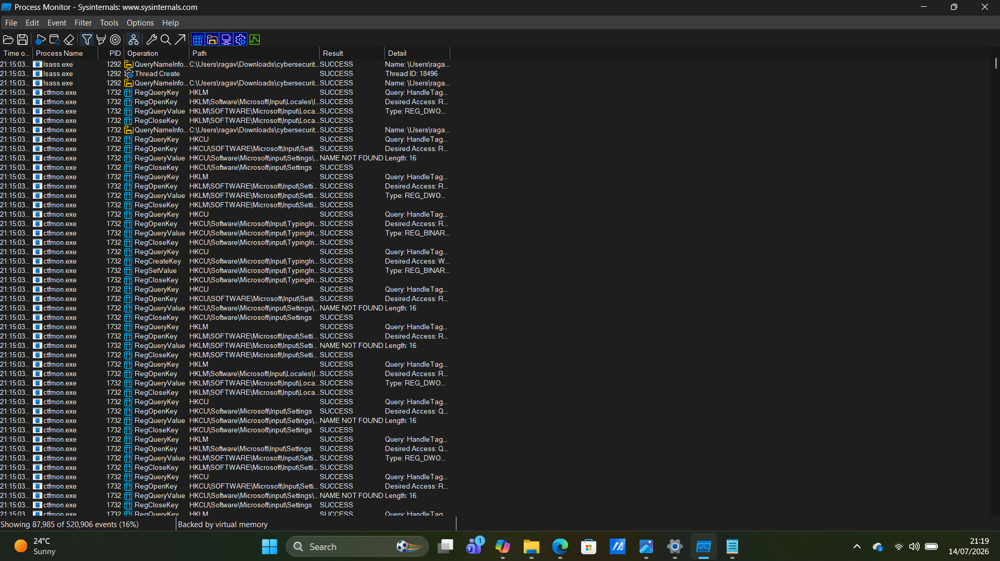
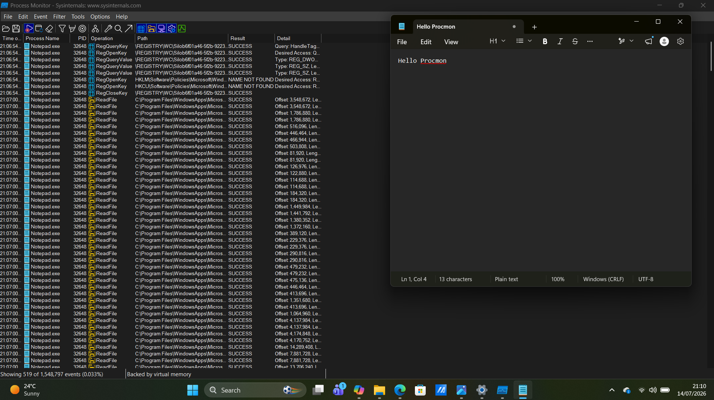
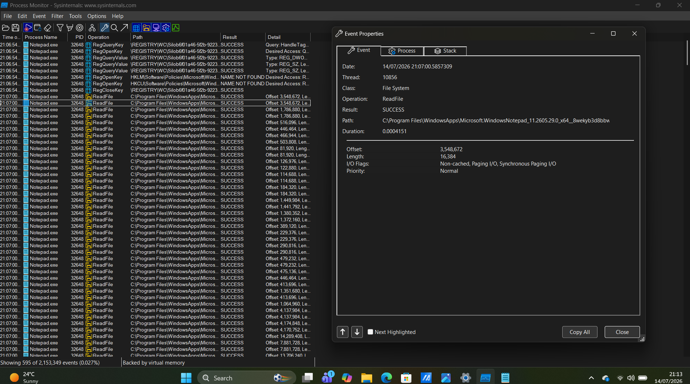

# Chapter 06 - Process Monitor (Procmon)

## Overview

Process Monitor (Procmon) is a Microsoft Sysinternals tool that captures real-time Windows activity. It records file system, registry, process, and thread events, making it an essential tool for troubleshooting, malware analysis, and digital forensics.

---

## Why SOC Analysts Use Process Monitor

SOC analysts use Process Monitor to:

- Monitor real-time Windows activity
- Investigate malware behavior
- Track registry changes
- Monitor file creation and modification
- Troubleshoot application issues
- Identify suspicious process activity

---

## Installation

1. Download Process Monitor from the Microsoft Sysinternals website.
2. Extract the ZIP file.
3. Run **Procmon64.exe** as Administrator.
4. Accept the Sysinternals license agreement.

---

## Navigation Guide

### Process Monitor Overview

When Process Monitor opens, it immediately starts capturing system activity.

The main window displays:

- Time of Day
- Process Name
- Process ID (PID)
- Operation
- Path
- Result
- Detail

### Screenshot



---

### Opening the Filter Window

Method 1:

- Click **Filter** on the menu bar.
- Select **Filter...**

Method 2:

- Press **Ctrl + L**

The Filter window allows you to display only the events you want to investigate.

Example:

```
Process Name is notepad.exe
```

Click:

- Add
- Apply
- OK

### Screenshot



---

### Opening Event Properties

To inspect an event:

Method 1:

- Double-click any event.

Method 2:

- Right-click an event.
- Select **Properties**.

The Event Properties window displays:

- Process Name
- Process ID (PID)
- Operation
- Path
- Result
- Timestamp
- Detail

### Screenshot



---

### Starting or Stopping Event Capture

To pause or resume capturing events:

- Click **File** → **Capture Events**
- Or press **Ctrl + E**

---

### Clearing Captured Events

To clear the current event list:

- Click **Edit** → **Clear Display**
- Or press **Ctrl + X**

---

## What to Look For

During an investigation, review:

- Process Name
- Process ID (PID)
- Operation
- File or Registry Path
- Result
- Timestamp
- Detail

Ask yourself:

- Is this process expected?
- Is it modifying important files or registry keys?
- Is it accessing sensitive system locations?
- Are there repeated failed operations?

---

## Common Operations

Common operations include:

- CreateFile
- ReadFile
- WriteFile
- RegOpenKey
- RegQueryValue
- RegSetValue
- Thread Create
- Process Create

Understanding these operations helps explain what an application is doing behind the scenes.

---

## Red Flags

Investigate if you observe:

- Unknown executables
- Programs running from Temp or AppData folders
- Unexpected registry modifications
- Suspicious DLL loading
- Numerous ACCESS DENIED results
- Unknown processes modifying system files

---

## Key Takeaways

- Process Monitor captures Windows activity in real time.
- The Filter window helps reduce noise and focus on specific processes.
- Event Properties provide detailed information about each captured event.
- Procmon is one of the most valuable tools for troubleshooting, malware analysis, and digital forensic investigations.
