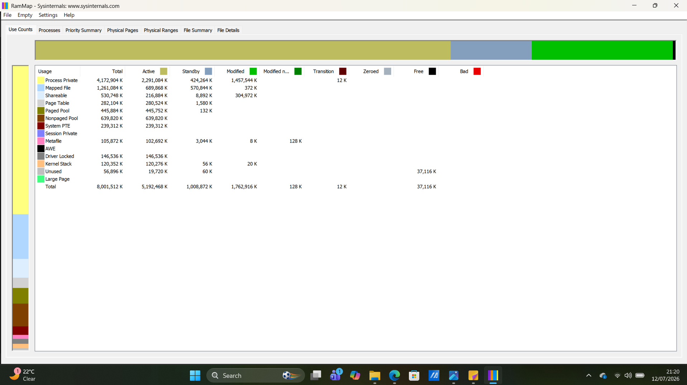
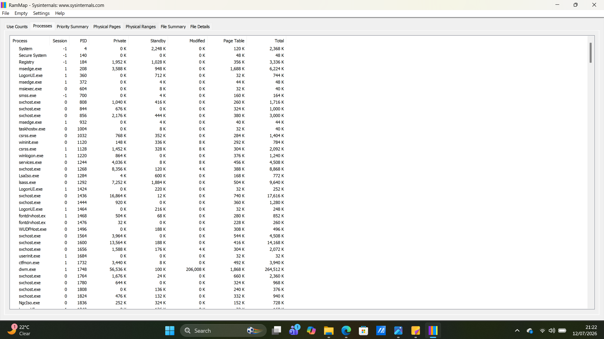
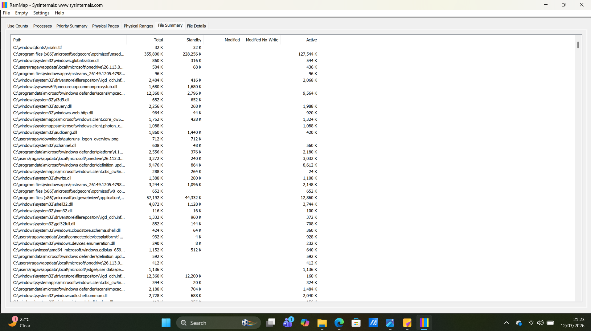

# Chapter 07 - RAMMap

## Overview

RAMMap is a Microsoft Sysinternals tool that analyzes how Windows uses physical memory (RAM). It provides a detailed breakdown of memory allocation, helping analysts understand system performance, investigate memory usage, and support malware analysis.

---

## Why SOC Analysts Use RAMMap

SOC analysts use RAMMap to:

- Analyze physical memory usage
- Identify memory-intensive processes
- Investigate memory leaks
- Understand Windows memory management
- Support malware investigations
- Troubleshoot performance issues

---

## Installation

1. Download RAMMap from the Microsoft Sysinternals website.
2. Extract the ZIP file.
3. Run **RAMMap.exe** as Administrator.
4. Wait for RAMMap to complete its memory analysis.

---

## Navigation Guide

### RAMMap Overview

When RAMMap starts, it automatically opens on the **Use Counts** tab, which provides an overview of how physical memory is allocated.

The main interface includes the following tabs:

- Use Counts
- Processes
- Priority Summary
- Physical Pages
- Physical Ranges
- File Summary
- File Details

### Screenshot

---

### Opening the Processes Tab

- Click the **Processes** tab at the top of the window.

Purpose:

View memory usage for each running process.

Information includes:

- Process Name
- Total Memory
- Private Memory
- Working Set
- Shareable Memory

### Screenshot

---

### Opening the File Summary Tab

- Click the **File Summary** tab at the top of the window.

Purpose:

View memory usage grouped by files currently loaded into physical memory.

This helps identify which files occupy the most RAM.

### Screenshot

---

### Refreshing Memory Information

To update the memory analysis:

- Click **File** → **Refresh**

RAMMap will perform a new scan of physical memory.

---

## What to Look For

During an investigation, review:

- Processes using excessive memory
- High Private Memory usage
- Large Working Sets
- Files occupying significant RAM
- Unusual memory allocation patterns

Ask yourself:

- Is the memory usage expected?
- Is a legitimate application consuming the memory?
- Is memory usage continuously increasing?
- Could this indicate a memory leak or suspicious activity?

---

## Important Memory Terms

### Private Memory

Memory used exclusively by a single process.

High Private Memory may indicate:

- Memory-intensive applications
- Memory leaks
- Suspicious or malicious processes

---

### Working Set

The amount of physical RAM currently assigned to a process.

A high Working Set is normal for applications actively in use.

---

### Standby Memory

Memory containing cached data that Windows can quickly reuse when needed.

Large Standby memory is generally normal and improves system performance.

---

## Red Flags

Investigate if you observe:

- Unknown processes consuming excessive memory
- Rapidly increasing memory usage
- Unusual memory allocation
- Unexpected kernel memory growth
- Applications consuming memory without releasing it

---

## Key Takeaways

- RAMMap provides a detailed view of Windows physical memory usage.
- The **Use Counts** tab offers an overview of memory allocation.
- The **Processes** tab shows memory usage by running applications.
- The **File Summary** tab displays which files occupy physical memory.
- High memory usage is not always malicious but should always be investigated in context.
