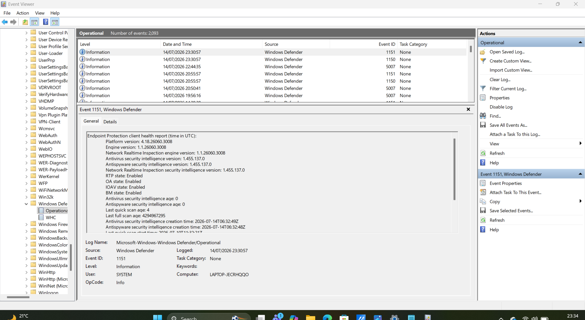
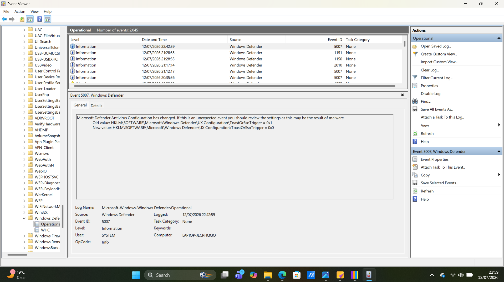
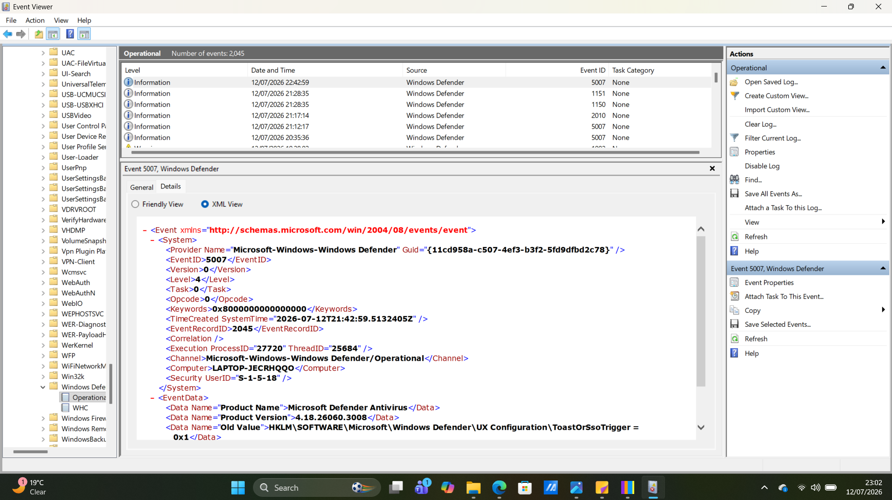

# Chapter 08 - Windows Defender Operational Logs

## Overview

Windows Defender Operational Logs are stored in Event Viewer and record events generated by Microsoft Defender Antivirus. These logs help SOC analysts monitor antivirus activity, detect security changes, investigate malware detections, and troubleshoot Defender-related events.

---

## Why SOC Analysts Use Windows Defender Logs

SOC analysts use Defender logs to:

- Investigate malware detections
- Monitor Defender configuration changes
- Review scan results
- Identify quarantined threats
- Detect suspicious changes to antivirus settings
- Support incident response investigations

---

## Navigation Guide

### Opening Windows Defender Operational Logs

1. Open **Event Viewer**.
2. Expand **Applications and Services Logs**.
3. Expand **Microsoft**.
4. Expand **Windows**.
5. Scroll down and select **Windows Defender**.
6. Click **Operational**.

This log displays Microsoft Defender events in chronological order.

### Screenshot

---

### Opening Event Details

To inspect an event:

Method 1:

- Double-click an event.

Method 2:

- Right-click an event.
- Select **Event Properties**.

The **General** tab displays a human-readable description of the event.

### Screenshot

---

### Opening the Details Tab

Inside Event Properties:

- Click the **Details** tab.
- Select **Friendly View**.

This view displays event information in an easy-to-read format.

### Screenshot

---

### Opening XML View

Inside the **Details** tab:

- Select **XML View**.

This displays the raw XML data recorded for the event.

Analysts often use XML View when creating detection rules or performing advanced investigations.

### Screenshot

---

### Filtering Events

To filter Defender logs:

1. Right-click **Operational**.
2. Select **Filter Current Log...**

Or:

- Click **Filter Current Log...** in the **Actions** pane.

Filters can be applied using:

- Event Level
- Event ID
- Date
- Keywords

Purpose:

Reduce noise and focus on relevant security events.

---

## What to Look For

During an investigation, review:

- Event ID
- Event Time
- Description
- User
- Computer Name
- Configuration Changes
- Malware Detection Events

Ask yourself:

- Was Defender configuration changed?
- Was malware detected or quarantined?
- Did an unexpected process modify Defender settings?
- Is this activity expected?

---

## Common Event IDs

Examples include:

- **1116** – Malware detected
- **1117** – Malware action taken
- **5007** – Microsoft Defender configuration changed
- **1150** – Defender engine updated
- **1151** – Defender platform updated

---

## Red Flags

Investigate if you observe:

- Defender being disabled unexpectedly
- Frequent configuration changes
- Malware detections
- Repeated scan failures
- Unknown users modifying Defender settings
- Multiple antivirus errors within a short period

---

## Key Takeaways

- Windows Defender Operational Logs record antivirus activity and configuration changes.
- The **General** tab provides a readable explanation of an event.
- The **Details** tab displays structured event data.
- **XML View** shows the raw event record for advanced analysis.
- Filtering logs helps analysts quickly locate relevant security events.
- Event ID **5007** is important because it records Defender configuration changes that may require investigation.
