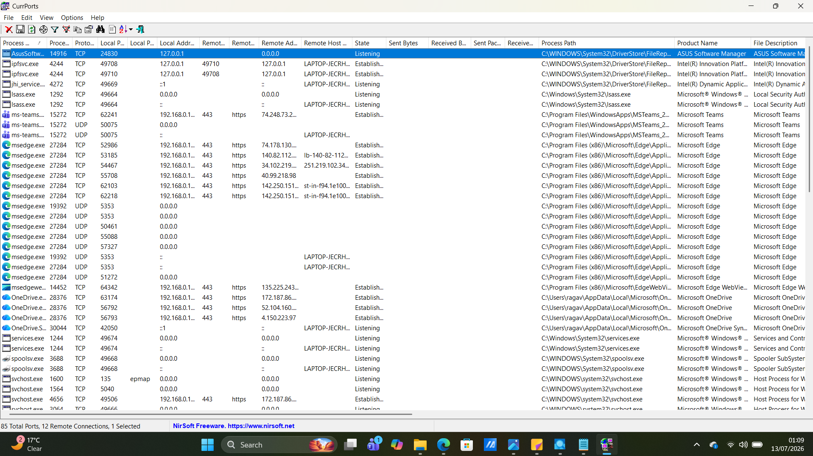
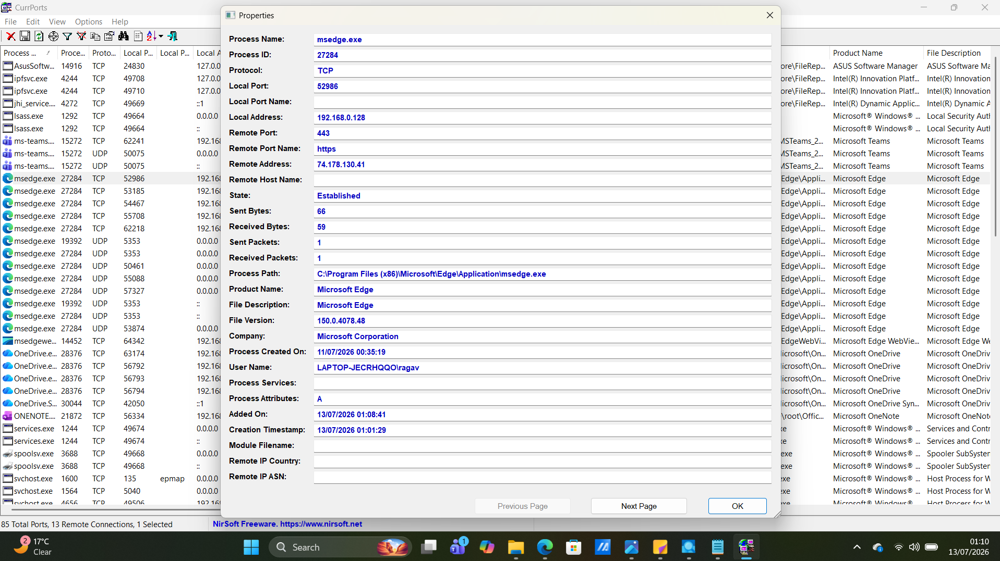

# Chapter 09 - CurrPorts

## Overview

CurrPorts is a free network monitoring tool developed by NirSoft that displays all active TCP and UDP ports on a Windows system. It shows which processes own each connection, the local and remote IP addresses, port numbers, connection states, and process information.

---

## Why SOC Analysts Use CurrPorts

SOC analysts use CurrPorts to:

- Monitor active network connections
- Identify which processes are communicating over the network
- Investigate suspicious outbound connections
- Detect unknown or unauthorized applications
- Support malware investigations
- Troubleshoot network-related issues

---

## Installation

1. Download CurrPorts from the NirSoft website.
2. Extract the ZIP file.
3. Run **cports.exe** as Administrator.

No installation is required.

---

## Navigation Guide

### CurrPorts Overview

When CurrPorts opens, it immediately displays all active TCP and UDP connections.

The main interface includes:

- Process Name
- Process ID (PID)
- Protocol
- Local Port
- Local Address
- Remote Port
- Remote Address
- Remote Host
- State
- Process Path

### Screenshot

---

### Opening Connection Properties

To inspect a connection:

Method 1:

- Double-click any connection.

Method 2:

- Right-click a connection.
- Select **Properties**.

The Properties window displays:

- Process Name
- Process ID (PID)
- Protocol
- Local Address
- Local Port
- Remote Address
- Remote Port
- Connection State
- Process Path
- File Version
- Company Name

### Screenshot

---

### Refreshing Connections

To refresh the connection list:

- Press **F5**

Or:

- Click **View** → **Refresh**

Purpose:

Update the list of active network connections.

---

### Sorting Connections

Click any column header to sort by:

- Process Name
- PID
- Protocol
- Local Port
- Remote Address
- State

Sorting helps identify suspicious or unusual network activity more quickly.

---

## Understanding Connection States

### Listening

The application is waiting for incoming network connections.

Example:

A web server listening on port 80.

---

### Established

The connection is currently active and exchanging data.

Example:

Microsoft Edge connected to a website over HTTPS (port 443).

---

### Closed

The connection has been terminated.

---

## What to Look For

During an investigation, review:

- Process Name
- Process Path
- Local IP Address
- Remote IP Address
- Remote Port
- Protocol
- Connection State

Ask yourself:

- Is the process legitimate?
- Is the remote IP address expected?
- Is the application communicating over a common port?
- Does the process path point to a trusted location?

---

## Red Flags

Investigate if you observe:

- Unknown processes with active internet connections
- Executables running from Temp or AppData folders
- Connections to unknown remote IP addresses
- Unexpected outbound traffic
- Processes using unusual ports
- Multiple connections from suspicious processes

---

## Key Takeaways

- CurrPorts displays all active TCP and UDP connections.
- It links each connection to the owning process.
- The Properties window provides detailed information about each connection.
- Reviewing remote IP addresses, ports, and process paths helps identify suspicious activity.
- CurrPorts is a valuable tool for network monitoring, malware analysis, and incident response.
